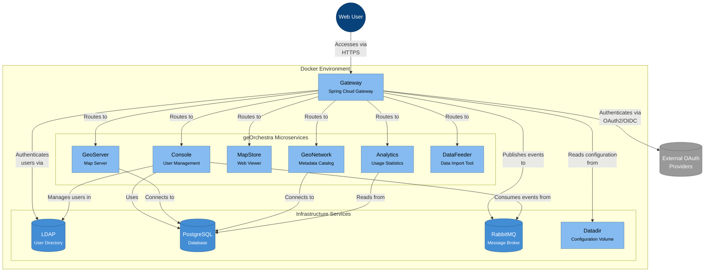

# Runtime View

The runtime view describes the dynamic aspects of the geOrchestra Gateway, showing how the various components interact during typical scenarios.

## C4 Microservices Diagram

This diagram shows the Gateway in its deployment context, interacting with other microservices and infrastructure components.



## Key Runtime Scenarios

### Authentication Flow

1. **LDAP Authentication Flow**

   ```mermaid
   sequenceDiagram
       actor User
       participant Gateway
       participant LDAP

       User->>Gateway: 1. Request protected resource
       Gateway->>User: 2. Redirect to login page
       User->>Gateway: 3. Submit credentials
       Gateway->>LDAP: 4. Validate credentials
       LDAP->>Gateway: 5. Authentication result

       alt Authentication successful
           Gateway->>LDAP: 6a. Load user attributes
           LDAP->>Gateway: 7a. User attributes
           Gateway->>Gateway: 8a. Create session
           Gateway->>User: 9a. Redirect to original request
       else Authentication failed
           Gateway->>User: 6b. Show error message
       end
   ```

2. **OAuth2/OpenID Connect Authentication Flow**

   ```mermaid
   sequenceDiagram
       actor User
       participant Gateway
       participant OAuth2Provider

       User->>Gateway: 1. Request protected resource
       Gateway->>User: 2. Redirect to login page
       User->>Gateway: 3. Click OAuth2 provider button
       Gateway->>OAuth2Provider: 4. Redirect to authorization endpoint
       OAuth2Provider->>User: 5. Show login page
       User->>OAuth2Provider: 6. Submit credentials
       OAuth2Provider->>Gateway: 7. Authorization code
       Gateway->>OAuth2Provider: 8. Exchange code for token
       OAuth2Provider->>Gateway: 9. Access token & user info
       Gateway->>Gateway: 10. Map to GeorchestraUser
       Gateway->>User: 11. Redirect to original request
   ```

3. **Request Processing Flow**

   ```mermaid
   sequenceDiagram
       actor User
       participant Gateway
       participant BackendService

       User->>Gateway: 1. HTTP request
       Gateway->>Gateway: 2. Route matching
       Gateway->>Gateway: 3. Remove security headers
       Gateway->>Gateway: 4. Resolve user
       Gateway->>Gateway: 5. Check access rules
       Gateway->>Gateway: 6. Apply path transformations
       Gateway->>Gateway: 7. Add security headers
       Gateway->>BackendService: 8. Forward request
       BackendService->>Gateway: 9. Response
       Gateway->>User: 10. Return response
   ```

## Structurizr Dynamic Views

As an alternative to Mermaid diagrams, we're also providing Structurizr DSL definitions for dynamic views. These are automatically generated from the DSL definition in `/docs/structurizr/dynamic-views.dsl`:

1. **Authentication Flow** - Shows the sequence of interactions during user authentication
   

2. **OAuth Flow** - Details the OAuth2/OpenID Connect authentication process
   

See the [Using Structurizr](using-structurizr.md) guide for more information about the Structurizr diagrams.

## Deployment Considerations

The Gateway is designed to be deployed as a Docker container, with all configuration externalized in a data directory volume. This allows for easy scaling and configuration changes without rebuilding the container.

Key runtime dependencies:

- Java 21+ runtime environment
- LDAP directory service for user authentication and management
- RabbitMQ for event notification
- Shared configuration volume (datadir)

## Scaling Strategies

The Gateway can be horizontally scaled by deploying multiple instances behind a load balancer. In this scenario:

- Sticky sessions should be enabled at the load balancer (the Gateway does not implement session sharing)
- Configuration should be consistent across all instances
- TLS termination should typically be handled at the load balancer level

## Monitoring and Operations

The Gateway exposes several endpoints for monitoring and operations:

- Health check endpoint: `/actuator/health`
- Metrics endpoint: `/actuator/metrics`
- Info endpoint: `/actuator/info`

These endpoints provide information about the health and performance of the Gateway, which can be integrated with monitoring tools.