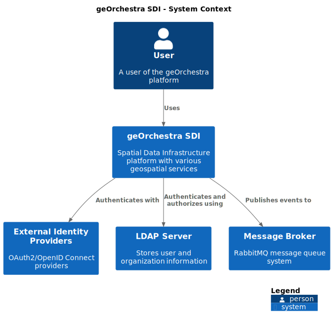
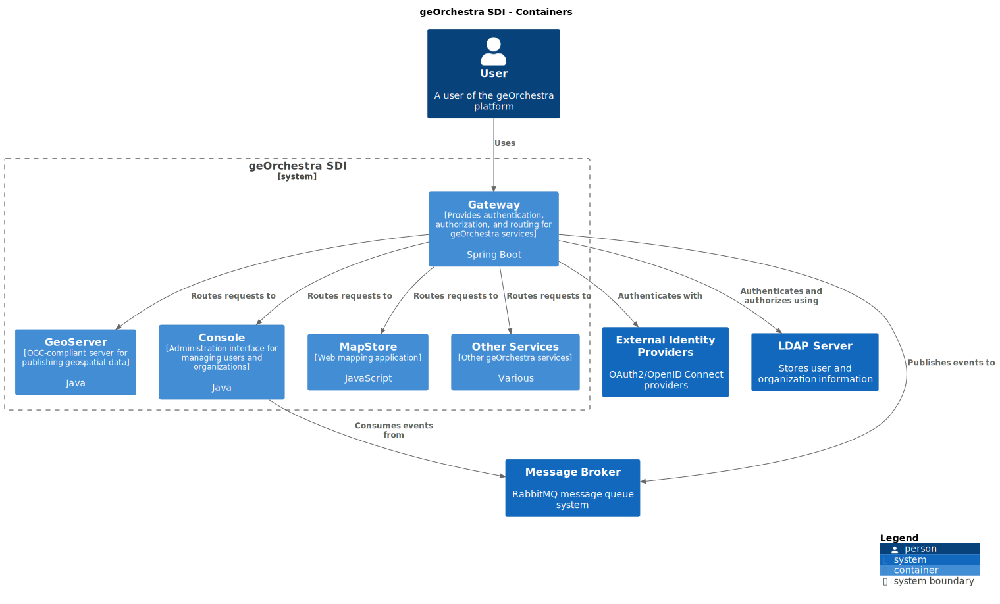
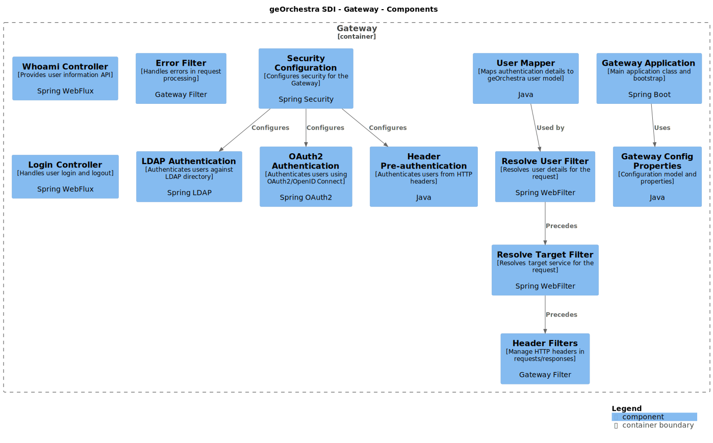
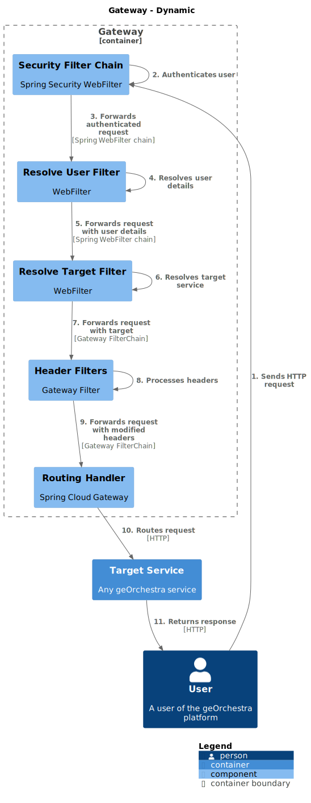
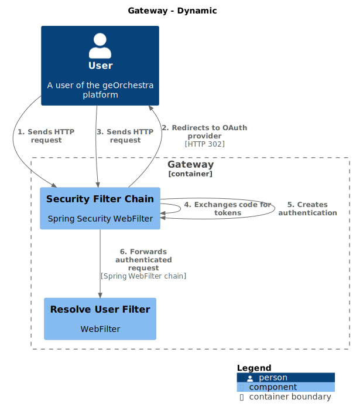

# Using Structurizr for Architecture Documentation

This guide explains how to use [Structurizr](https://structurizr.com/) to generate C4 model diagrams for the geOrchestra Gateway architecture documentation.

## Introduction to Structurizr

Structurizr is a tool for creating software architecture diagrams based on the [C4 model](https://c4model.com/) (Context, Containers, Components, and Code). Unlike graphical diagramming tools, Structurizr uses a textual DSL (Domain-Specific Language) to define architecture models, promoting version control and collaboration.

Advantages of Structurizr:
- Single source of truth for all architecture diagrams
- Consistent notation and styling across all diagrams
- Version-controlled along with the codebase
- Automated diagram generation from code

## Available C4 Diagrams

We have created the following C4 diagrams for the geOrchestra Gateway:

1. **System Context Diagram** - Shows the Gateway in the context of the overall system
   

2. **Container Diagram** - Shows the high-level containers that make up the Gateway
   

3. **Component Diagram** - Shows the internal components of the Gateway
   

4. **Dynamic Views** - Shows runtime interactions
   - **Authentication Flow** - Shows the sequence of interactions during user authentication
     
   - **OAuth Flow** - Details the OAuth2/OpenID Connect authentication process
     

## Structurizr DSL

The Structurizr DSL provides a simple way to define your software architecture model and views. The model is defined in a `.dsl` file:

```
workspace "geOrchestra Gateway" {
    model {
        user = person "User"
        system = softwareSystem "Gateway" {
            container = container "Web Application" {
                component = component "Component"
            }
        }
    }

    views {
        systemContext system "SystemContext"
        container system "Containers"
        component container "Components"
    }
}
```

## Working with Structurizr Diagrams

### Generating Diagrams Locally

To generate diagrams locally, you need:

1. Java runtime environment
2. Structurizr CLI (available at https://github.com/structurizr/cli/releases)
3. PlantUML for rendering SVG files

Or you can use Docker:

```bash
# Generate PlantUML files from Structurizr DSL
docker run --rm -v "$PWD/docs/structurizr:/usr/local/structurizr" structurizr/cli export -workspace /usr/local/structurizr/workspace.dsl -format plantuml/c4plantuml -output /usr/local/structurizr/exports

# Generate SVG files from PlantUML files
docker run --rm -v "$PWD/docs/structurizr:/data" plantuml/plantuml -tsvg "/data/exports/*.puml" -o "/data/../assets/images/structurizr"
```

### Automated Diagram Generation

We have a GitHub Actions workflow that automatically generates the diagrams when changes are made to the DSL files. The workflow:

1. Exports the Structurizr DSL to PlantUML files
2. Renders the PlantUML files to SVG
3. Commits the updated diagrams back to the repository

## Modifying the Architecture Model

To update the architecture model:

1. Edit the `/docs/structurizr/workspace.dsl` file for static architecture views
2. Edit the `/docs/structurizr/dynamic-views.dsl` file for dynamic runtime views
3. Commit your changes
4. The GitHub Actions workflow will automatically update the diagrams

**Important**: When making changes to dynamic views in the DSL file, make sure to define all the relationships in the model section that you'll use in the dynamic views.

## References

- [Structurizr Documentation](https://docs.structurizr.com/)
- [C4 Model](https://c4model.com/)
- [Structurizr DSL Reference](https://github.com/structurizr/dsl/blob/master/docs/language-reference.md)