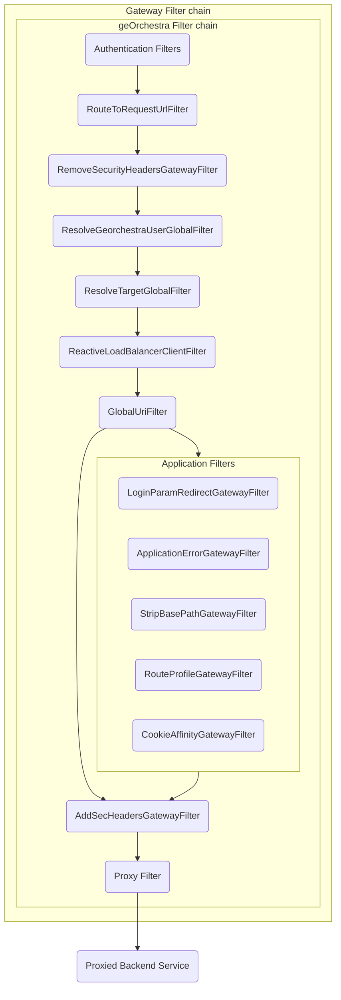

# Custom Filters

geOrchestra Gateway extends Spring Cloud Gateway with custom filters to provide additional functionality. This document describes the custom filters and how to create your own.

## Global Filters

[Global filters](https://docs.spring.io/spring-cloud-gateway/reference/spring-cloud-gateway/global-filters.html) are special filters that are conditionally applied to all routes.

The **geOrchestra Gateway** provides the following global filters:

### ResolveTargetGlobalFilter

Resolves the `GeorchestraTargetConfig` for the request's matched `Route` and stores as a `ServerWebExchange` attribute.
`GeorchestraTargetConfig` contains the target service's security header requirements and the set of role-based access
rules to different service endpoints.

!!! important "Service-Route Mapping Implementation Note"
    The `ResolveTargetGlobalFilter` is responsible for establishing the connection between a Spring Cloud Gateway route and a geOrchestra service configuration. It does this by matching the route's URI with the service's target URL.
    
    This is why the geOrchestra service target URL **must match** the route URI defined in `routes.yaml`. This design creates a dual configuration requirement that is currently necessary for applying access rules correctly, but is identified as technical debt to be addressed in a future refactoring.

### ResolveGeorchestraUserGlobalFilter

Resolves the `GeorchestraUser` from the request's `Authentication` so it can be retrieved down the chain during a server
web exchange filter chain execution.

The resolved per-request `GeorchestraUser` object can then, for example, be used to append the necessary `sec-*` headers that relate
to user information to proxied HTTP requests.

## Filter Chain Overview

The geOrchestra Gateway filter chain includes the following custom filters:



The filter chain execution follows a specific order, with each filter performing a unique function:

1. **Authentication Filters**: Handle user authentication via LDAP, OAuth2, or HTTP headers
2. **RouteToRequestUrlFilter**: Core Spring Cloud Gateway filter that matches routes
3. **RemoveSecurityHeadersGatewayFilter**: Removes incoming sec-* headers to prevent impersonation
4. **ResolveGeorchestraUserGlobalFilter**: Extracts authenticated user information
5. **ResolveTargetGlobalFilter**: Determines the target service configuration
6. **ReactiveLoadBalancerClientFilter**: Handles service load balancing (built-in Spring filter)
7. **GlobalUriFilter**: Fixes URI encoding issues
8. **Application-specific Filters**: Can be applied based on route configuration:
   - **LoginParamRedirectGatewayFilter**: Redirects to login when requested
   - **ApplicationErrorGatewayFilter**: Handles application errors and creates friendly responses
   - **StripBasePathGatewayFilter**: Removes base path prefixes
   - **RouteProfileGatewayFilter**: Enables routes based on active Spring profiles
   - **CookieAffinityGatewayFilter**: Modifies cookie paths for service sharing
9. **AddSecHeadersGatewayFilter**: Adds user and organization headers for backend services (runs after both GlobalUriFilter and any application-specific filters)
10. **Proxy Filter**: Handles the actual HTTP request to the backend

Note that the GlobalUriFilter can either flow directly to AddSecHeadersGatewayFilter or through application-specific filters first, depending on the route configuration.

## Main Custom Filters

### RemoveSecurityHeadersGatewayFilter

Removes security headers from incoming requests to prevent impersonation.

**Class**: `org.georchestra.gateway.filter.headers.RemoveSecurityHeadersGatewayFilterFactory`

**Configuration**:
```yaml
spring:
  cloud:
    gateway:
      default-filters:
        - RemoveSecurityHeaders
```

### ResolveTargetGlobalFilter

Resolves the target service for the request.

**Class**: `org.georchestra.gateway.filter.global.ResolveTargetGlobalFilter`

**Configuration**: This filter is automatically added to the filter chain.

### ResolveGeorchestraUserGlobalFilter

Resolves the geOrchestra user from the security context.

**Class**: `org.georchestra.gateway.security.ResolveGeorchestraUserGlobalFilter`

**Configuration**: This filter is automatically added to the filter chain.

### AddSecHeadersGatewayFilter

Adds security headers to outgoing requests to provide user information to backend services. This filter works with multiple header contributors to populate different types of headers.

**Class**: `org.georchestra.gateway.filter.headers.AddSecHeadersGatewayFilterFactory`

**Header Contributors**:
- `GeorchestraUserHeadersContributor`: Adds user-related headers (username, email, roles)
- `GeorchestraOrganizationHeadersContributor`: Adds organization-related headers
- `JsonPayloadHeadersContributor`: Adds Base64-encoded JSON payloads with user and org information
- `SecProxyHeaderContributor`: Adds the sec-proxy header when enabled

**Configuration**:
```yaml
spring:
  cloud:
    gateway:
      default-filters:
        - AddSecHeaders
```

## Other Custom Filters

### LoginParamRedirectGatewayFilter

Redirects to login page when the `login` query parameter is present.

**Class**: `org.georchestra.gateway.filter.global.LoginParamRedirectGatewayFilterFactory`

**Configuration**:
```yaml
spring:
  cloud:
    gateway:
      default-filters:
        - LoginParamRedirect
```

### ApplicationErrorGatewayFilter

Provides custom error pages when proxied applications return error status codes (4xx or 5xx). This filter intercepts error responses from backend services and triggers Spring Boot's error handling mechanism to display custom error templates instead of passing through the raw error responses from the backend service.

When an error status is detected, the filter throws a `ResponseStatusException` with the same status code, causing Spring Boot to render the appropriate error template based on the status code (e.g., `404.html`, `500.html`).

**Class**: `org.georchestra.gateway.filter.global.ApplicationErrorGatewayFilterFactory`

**How it works**:

1. The filter checks if the request is idempotent (GET, HEAD, OPTIONS) and accepts HTML content
2. If applicable, it decorates the response with a wrapper that monitors the status code
3. When a 4xx or 5xx status code is detected from the backend service, it throws a `ResponseStatusException`
4. Spring Boot's error handling then renders the appropriate error template from `/templates/error/[status-code].html`

**Custom error templates**:

- Located in `src/main/resources/templates/error/`
- Named by status code (e.g., `404.html`, `500.html`)
- Can be customized by adding your own templates in the same location

**Configuration**:
```yaml
spring:
  cloud:
    gateway:
      default-filters:
        - ApplicationError
```

### CookieAffinityGatewayFilter

Duplicates cookies to make them available to other services.

**Class**: `org.georchestra.gateway.filter.headers.CookieAffinityGatewayFilterFactory`

**Configuration**:
```yaml
spring:
  cloud:
    gateway:
      routes:
        - id: service
          filters:
            - name: CookieAffinity
              args:
                name: COOKIE_NAME
                from: /original/path
                to: /new/path
```

### GlobalUriFilter

Corrects double-encoded URLs in Spring Cloud Gateway, preventing unintentional URI re-encoding.

**Class**: `org.geoserver.cloud.gateway.filter.GlobalUriFilter`

**Configuration**: This filter is automatically added to the filter chain.

### RouteProfileGatewayFilter

Enables or disables routes based on the active Spring profiles.

**Class**: `org.geoserver.cloud.gateway.filter.RouteProfileGatewayFilterFactory`

**Configuration**:
```yaml
spring:
  cloud:
    gateway:
      routes:
        - id: service
          filters:
            - name: RouteProfile
              args:
                profiles: profile1,profile2
                negate: false  # Optional, defaults to false
```

### StripBasePathGatewayFilter

Strips the base path from incoming requests.

**Class**: `org.geoserver.cloud.gateway.filter.StripBasePathGatewayFilterFactory`

**Configuration**:
```yaml
spring:
  cloud:
    gateway:
      routes:
        - id: service
          filters:
            - name: StripBasePath
              args:
                basePath: /service
```

## Creating Custom Filters

You can create custom filters to extend the gateway's functionality. There are two types of filters:

1. **GatewayFilter**: Applied to specific routes
2. **GlobalFilter**: Applied to all requests

### Creating a Gateway Filter

To create a custom gateway filter:

1. Create a class extending `AbstractGatewayFilterFactory`
2. Implement the `apply` method
3. Register the filter factory as a bean

Example:

```java
@Component
public class CustomGatewayFilterFactory extends AbstractGatewayFilterFactory<CustomGatewayFilterFactory.Config> {

    public CustomGatewayFilterFactory() {
        super(Config.class);
    }

    @Override
    public GatewayFilter apply(Config config) {
        return (exchange, chain) -> {
            // Filter logic here
            return chain.filter(exchange);
        };
    }

    public static class Config {
        // Configuration properties
    }
}
```

### Creating a Global Filter

To create a custom global filter:

1. Create a class implementing `GlobalFilter` and `Ordered`
2. Implement the `filter` method
3. Implement the `getOrder` method
4. Register the filter as a bean

Example:

```java
@Component
public class CustomGlobalFilter implements GlobalFilter, Ordered {

    @Override
    public Mono<Void> filter(ServerWebExchange exchange, GatewayFilterChain chain) {
        // Filter logic here
        return chain.filter(exchange);
    }

    @Override
    public int getOrder() {
        return Ordered.HIGHEST_PRECEDENCE; // or any other order
    }
}
```

### Filter Registration

Filters are automatically registered with Spring's dependency injection when annotated with `@Component`.

For gateway filters, you also need to configure them in the gateway routes:

```yaml
spring:
  cloud:
    gateway:
      routes:
        - id: my-route
          uri: http://example.org
          predicates:
            - Path=/example/**
          filters:
            - name: Custom
              args:
                param1: value1
```

For global filters, no additional configuration is needed.

## Testing Filters

To test custom filters, you can use Spring's `WebTestClient` or write unit tests:

```java
@SpringBootTest
public class CustomFilterTest {

    @Autowired
    private WebTestClient webClient;

    @Test
    public void testFilter() {
        webClient.get().uri("/path")
            .exchange()
            .expectStatus().isOk()
            // Further assertions
    }
}
```

For unit tests, you can create a mock `ServerWebExchange` and `GatewayFilterChain`.
