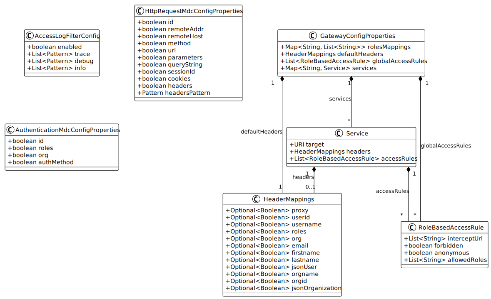

# Project Structure

This document outlines the structure of the geOrchestra Gateway project to help developers navigate and understand the codebase.

## Overall Structure

The geOrchestra Gateway is a Spring Boot application built on Spring Cloud Gateway. The project follows a standard Maven project structure:

```
georchestra-gateway/
├── datadir/             # Configuration templates for external configuration
├── docs/                # Project documentation
├── gateway/             # Main application code
│   ├── src/main/java/   # Java source code
│   ├── src/main/resources/ # Resources (templates, properties)
│   └── src/test/        # Test code and resources
├── modules/             # Additional modules and extensions
├── CLAUDE.md            # Build and development guidelines
├── pom.xml              # Parent POM file
└── README.md            # Project overview
```

## Key Packages

The Java source code is organized into the following key packages:

### `org.georchestra.gateway.app`

Contains the main application class (`GeorchestraGatewayApplication`) and controllers for core functionality like login/logout, whoami, and style configuration.

### `org.georchestra.gateway.security`

Manages security-related components including:

- Authentication providers (LDAP, OAuth2/OpenID Connect, Header pre-authentication)
- User mapping and customization
- Access control rules
- Security configuration

### `org.georchestra.gateway.filter`

Contains Gateway filter implementations for:

- Global filters applied to all requests
- Header manipulation (adding, removing, modifying)
- Error handling

### `org.georchestra.gateway.model`

Contains data models and configuration properties classes used throughout the application.

### `org.georchestra.gateway.accounts`

Handles user account management functionality, including:

- Account creation
- Event handling (via RabbitMQ)
- LDAP account management

### `org.georchestra.gateway.autoconfigure`

Contains auto-configuration classes for Spring Boot to automatically configure various components based on application properties.

## Test Structure

Tests follow the same package structure as the main code, with integration tests typically having an "IT" suffix and unit tests having a "Test" suffix.

### Integration Tests

Integration tests use Spring Boot's testing capabilities to test components in a running application context. These tests may:

- Start embedded servers
- Configure mock security contexts
- Test interaction between multiple components

### Unit Tests

Unit tests focus on testing individual components in isolation, using mocks for dependencies.

## Resource Structure

The `src/main/resources` directory contains:

- `application.yml` - Default application configuration
- `messages/` - Internationalization resource bundles
- `static/` - Static resources (CSS, JavaScript, images)
- `templates/` - HTML templates (using Thymeleaf)
- Spring configuration metadata and factories

## Configuration Structure

The geOrchestra Gateway uses a multi-layered configuration approach:

1. Default values in `application.yml`
2. External configuration from `datadir/gateway`
3. Environment variables and system properties
4. Command-line arguments

This allows for flexible deployment and configuration management across different environments.

### Configuration Object Model

The following diagram shows the main configuration classes and their relationships:



The diagram shows:

- **GatewayConfigProperties**: The root configuration class that holds role mappings, default headers, global access rules, and service configurations.
- **Service**: Represents a backend service configuration with its target URL, headers, and access rules.
- **HeaderMappings**: Controls which user and organization headers are forwarded to backend services.
- **RoleBasedAccessRule**: Defines access rules based on URL patterns and roles.
- **AccessLogFilterConfig**: Configures which requests are logged and at what log levels.
- **HttpRequestMdcConfigProperties**: Controls which HTTP request properties are included in logs.
- **AuthenticationMdcConfigProperties**: Controls which user authentication properties are included in logs.

These configuration classes are defined in the `org.georchestra.gateway.model` package and provide the structure for the YAML-based configuration files used by the Gateway.