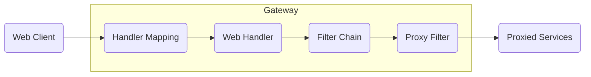
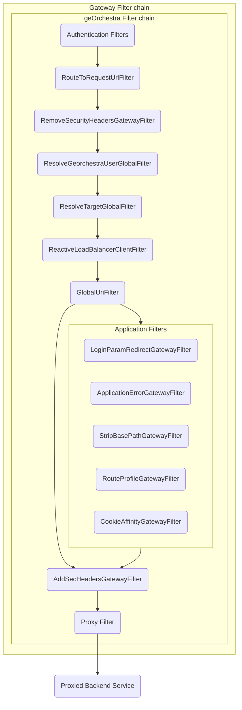

# geOrchestra Gateway

**geOrchestra Gateway** is a [Spring Cloud Gateway](https://docs.spring.io/spring-cloud-gateway/docs/current/reference/html/) service acting as the single entry point to back-end geOrchestra applications, handling authentication and authorization on their behalf.

## About geOrchestra

[geOrchestra](https://www.georchestra.org/) is a free, modular, and interoperable Spatial Data Infrastructure (SDI) software born in 2009 to meet the requirements of the INSPIRE European directive. It provides:

- A comprehensive suite of integrated geospatial applications
- Community-driven development with a focus on interoperability
- A modular approach allowing customization to specific needs

geOrchestra is governed by a Project Steering Committee (PSC) which consists of 9 members that ensure the project complies with its founding principles. The PSC can be contacted at psc@georchestra.org.

The Gateway component replaces the previous security-proxy and serves as the central entry point for all geOrchestra services, providing modern authentication methods and enhanced security features.

## Overview

The following diagram provides a high-level overview of how Spring Cloud Gateway works:

Clients make requests to the Gateway. If the Gateway Handler Mapping determines that a request matches a route, it is sent to the Gateway Web Handler. This handler runs the request through a filter chain that is specific to the request. Filters can run logic both before and after the proxy request is sent. All "pre" filter logic is executed. Then the proxy request is made. After the proxy request is made, the "post" filter logic is run.

## Features

- OAuth2 and OpenID Connect authentication and authorization
- LDAP authentication and authorization
- HTTP/2 support
- Websockets support
- Role-based access control
- Header forwarding to backend applications

## Documentation Sections

This documentation is divided into three main sections:

1. **User Guide** - Documentation for users and system administrators who want to install, configure, and use geOrchestra Gateway.

2. **Technical Documentation (arc42)** - Structured documentation of the system architecture following the arc42 template.

3. **Developer Guide** - Documentation for developers who want to contribute to or extend geOrchestra Gateway.